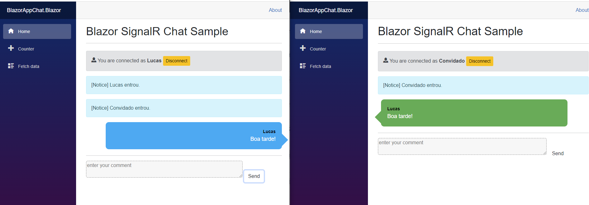

# Agendamento
<br>
<div align="center">


<!--  -->


</div>

<!--


-->
> Um aplicativo de chat.
> ## 💻 Pré-requisitos

Antes de começar, certifique-se de atender a estes requisitos requisitos:

* Você instalou a versão estável mais recente do `.NET`

## 🚀 Configuração do projeto

Para instalar, siga estes passos:

Clone o projeto e execute o comando no diretório raiz:
```
git clone
```
## ☕ Usando o Chat

#### Execute este comando em seu CMD no caminho raiz da api:
#### Execute este comando em seu CMD no caminho raiz da aplicacao Blazor:
```
dotnet run
```

Bom teste!
<div>
    
</div>
